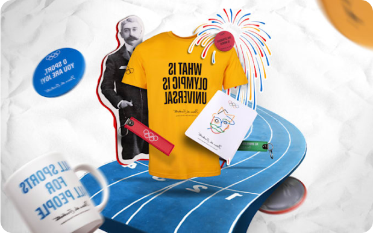

# Olypedia-testing
Test Repo for Olypedia website
 

            

               
            

            

                   <h4 class="mt-4 text-3xl text-white ml-8 leading-10 font-bold max-md:text-xl max-[331px]:text-lg">Shop New Olympic Collection</h4>
                   
Our new Collection is emblazoned with inspirational quotes and designs of the founder of the modern Olympic Games Pierre de Coubertin.

                   <button style="background: linear-gradient(52deg, #5D50C6 14.61%, rgba(247, 15, 113, 0.00) 79.22%);" class="ml-8 mt-4 border-[0.2rem] border-[#fff] rounded-3xl px-5 py-2 mb-4 text-white font-normal text-sm "> Shop now </button>         
            

     
